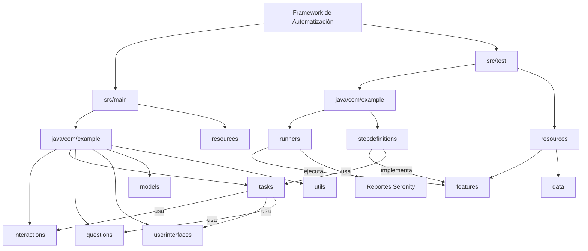

# 🚀 Framework de Automatización de Pruebas

**Java + Serenity BDD + Selenium + Cucumber**

---

## 📌 Descripción

Este proyecto corresponde al desarrollo de un **framework modular para la automatización de pruebas de software**, implementado en Java utilizando Serenity BDD como base, bajo el enfoque **BDD (Behavior Driven Development)**.

El framework permite la ejecución de pruebas automatizadas tanto para:

* 🌐 Interfaces web (UI Testing)
* 🔗 Servicios (API Testing)

Además, está diseñado bajo principios de **modularidad, reutilización y escalabilidad**, permitiendo su adaptación a diferentes proyectos.

---

## 🎯 Objetivo

Construir un framework base reutilizable que permita:

* Automatizar pruebas funcionales
* Reducir errores humanos
* Aumentar la cobertura de pruebas
* Generar reportes detallados automáticamente

---


## 🧱 Arquitectura del Framework

El framework sigue una arquitectura modular basada en el patrón **Screenplay**, separando responsabilidades entre la lógica de negocio, ejecución de pruebas y configuración.




### 🔹 Capas principales

* **Runners:** Ejecutan los escenarios de prueba
* **StepDefinitions:** Implementan la lógica de los pasos (BDD)
* **Hooks:** Configuración antes/después de pruebas
* **Features:** Escenarios en lenguaje Gherkin

---

## 🛠️ Tecnologías utilizadas

* ☕ Java
* 🧪 Serenity BDD
* 🌐 Selenium WebDriver
* 🥒 Cucumber (BDD)
* 🧪 JUnit
* ⚙️ Gradle

---

## ⚙️ Requisitos previos

Antes de ejecutar el proyecto, asegúrate de tener instalado:

* Java JDK 11 o superior
* Gradle (opcional, ya incluido con wrapper)
* Navegador web (Chrome recomendado)
* IDE (IntelliJ IDEA recomendado)

---

## 💻 Configuración del entorno

### 🔹 Variables de entorno (opcional)

Puedes definir variables como:

```
BROWSER=chrome
ENV=dev
```

O configurarlas directamente en:

```
serenity.conf
serenity.properties
```

---

## 🌐 Configuración del navegador

Por defecto, el framework utiliza:

* Google Chrome

Puedes cambiarlo en:

```
serenity.properties
```

Ejemplo:

```
webdriver.driver=chrome
```

---

## ▶️ Ejecución del proyecto

### 🔹 Desde terminal

```bash
./gradlew clean test
```

En Windows:

```bash
gradlew.bat clean test
```

---

### 🔹 Desde IDE (IntelliJ)

* Ejecutar clase Runner
* O ejecutar Gradle task: `test`

---

## 📊 Reportes

Después de ejecutar las pruebas, Serenity genera automáticamente reportes en:

```
target/site/serenity/index.html
```

### 🔍 Contenido del reporte:

* Estado de pruebas (Passed/Failed)
* Tiempos de ejecución
* Detalle paso a paso
* Evidencia visual (si aplica)

---

## 🧪 Escenarios implementados

### 🔹 Pruebas UI

* Login exitoso
* Login inválido

### 🔹 Pruebas API

* Consumo de servicios
* Validación de respuestas HTTP (200, etc.)

---

## 📂 Ejemplo de escenario (Gherkin)

```gherkin
Feature: Login

Scenario: Login exitoso
  Given el usuario está en la página de login
  When ingresa credenciales válidas
  Then accede al sistema
```

---

## 🔐 Buenas prácticas implementadas

* Separación de responsabilidades
* Uso de BDD
* Código reutilizable
* Configuración desacoplada
* Automatización escalable

---

## 🚧 Posibles mejoras futuras

* Integración con CI/CD (Jenkins / GitHub Actions)
* Automatización móvil (Appium)
* Integración con IA para generación de pruebas

---

## 👨‍💻 Autor

**Jose Daniel Pasos Bolaños**
Ingeniería de Sistemas – ITM

---

## 📄 Licencia

Este proyecto es de uso académico y puede ser adaptado para fines educativos y profesionales.

---

## ⭐ Nota

Este framework puede ser utilizado como base para nuevos proyectos de automatización, facilitando la estandarización y mejora continua en procesos de aseguramiento de calidad.

---
